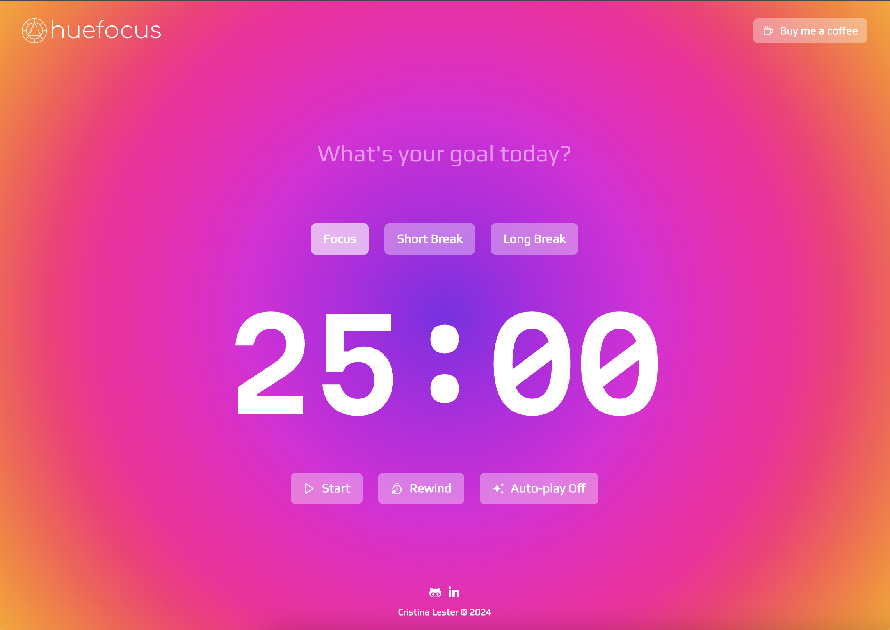

# HueFocus

## Fabulous Pomodoro Timer

This is a pomodoro timer to manage your productive work like a boss.

### Tech Stack

- Vite
- React
- TypeScript
- Chackra UI
- Styled Components

### Installation

1. Install dependencies.
   Use your preferred package manager (npm, yarn, or pnpm) to install the project dependencies:

`npm install`

2. Start the development server.
   Once the dependencies are installed, you can start the Vite development server:

`npm run dev`

This will usually start the server at http://localhost:5173/ (or another port if specified in the project configuration).

## License

This project is licensed under the MIT License - see the [LICENSE.md](LICENSE.md) file for details
